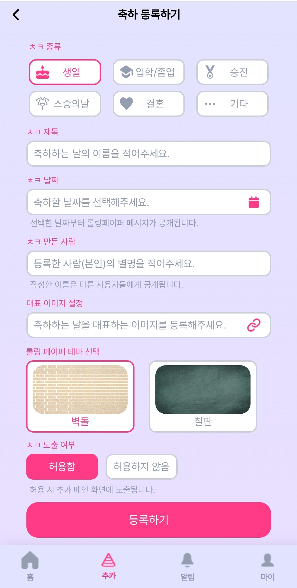
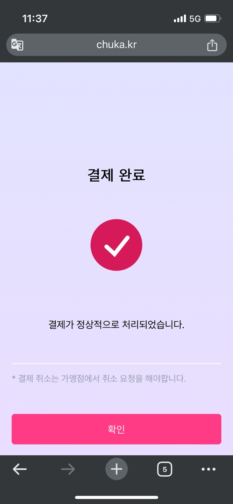

# :love_letter: 우리들의 추억의 카드 ㅊㅋ

특별한 날 마음을 전달하기 어려우셨나요? 
축하 받는 사람도 축하 하는 사람도 행복한 서비스를 만들었습니다. 
이벤트 해당 일자에 오픈 되는 롤링페이퍼와 선물 펀딩을 함께 경험해보세요. 

> 개발 기간 : 2024-04-08 ~ 2024-05-20

 

# :scroll: 산출물

- [요구사항정의서](https://broadleaf-rosehip-ec8.notion.site/1f93a3803dde43c6ac0a7baadbb85aeb)
- [기능명세서](https://broadleaf-rosehip-ec8.notion.site/50fcb063ccc54adeb6465ec11dd6bd11)
- [API명세서](https://broadleaf-rosehip-ec8.notion.site/API-297fa08688a645059db2732bbdb4bea1)
- [화면정의서](https://www.figma.com/design/6apeUwpzSfb3UotQeXqGcF/%E3%85%8A%E3%85%8B?node-id=0-1&t=v86S4JliUXhMWVY6-0)
- [포팅매뉴얼](./exec/추카_포팅_매뉴얼.docx)
- [발표자료](./exec/10기_자율PJT_발표자료_C107.pdf)

---

# :pushpin: 목차

1. [Role](#role)
2. [기술스택](#기술스택)
3. [서비스](#서비스)
   - [소셜로그인](#소셜로그인)
   - [메인화면](#메인화면)
   - [이벤트](#이벤트)
   - [롤링페이퍼](#롤링페이퍼)
   - [펀딩](#펀딩)
   - [간편결제](#간편결제)
   - [마이페이지](#마이페이지)
   - [푸시알림](#푸시알림)

 

---

# :crown: Role

| 이름   | 역할                                             |
| ------ | ------------------------------------------------ |
| 강민지 | **팀장** **발표** **프론트엔드**  |
| 김신영 | **백엔드**                                       |
| 김지연 | **백엔드**                                  |
| 박태호 | **백엔드** **인프라**                  |
| 이현호 | **백엔드** **인프라**                  |
| 승재홍 | **프론트엔드**                                   |

---

# :key: 기술스택

### BackEnd

- JAVA 17
- SpringBoot 3
- Spring Security 6.2.4
- Spring Data JPA
- Spring Cloud Config Server
- Spring Cloud Routing
- Spring cloud netflix Eureka Server
- RabbitMQ
- Python 3.12
- Flask 3.0.3
- BeautifulSoup4 4.10.0
- Selenium 4.16.0
- gunicorn 20.1.0

### FrontEnd

- React 18.2.0
- Typescript 5.2.2
- Vite 5.2.0
- Styled-component 6.1.8
- Recoil 0.7.7
- Axios 1.6.8

### DB

- MySQl 8.0.36
- MongoDB
- Redis

### INFRA

- AWS EC2 ubuntu 20.04
- CI/CD : Jenkins
- Nginx
- Docker
- DockerCompose

### 외부 서비스

- Firebase FCM
- Kakao Login
- PG

 

---

# :tada: 서비스

## 아키텍처

&nbsp; &nbsp;

## ERD

&nbsp; &nbsp;

## 소셜로그인

> 소셜로그인을 이용해 간편하게 회원가입, 로그인을 진행합니다.

 

&nbsp; &nbsp;

## 메인화면

> 공개된 축하를 확인하고 축하를 등록할 수 있습니다.  
> 사용자 후기를 통해 고객의 니즈를 파악하고, 서비스를 개선합니다.  
> 누적 축하 이벤트와 메시지를 확인할 수 있습니다.

 

&nbsp; &nbsp;

## 이벤트

> 축하할 이벤트를 등록할 수 있습니다.  
> 이벤트에서 진행하는 펀딩을 확인할 수 있습니다.

 

&nbsp; &nbsp;
&nbsp; &nbsp;
&nbsp; &nbsp;

## 롤링페이퍼

> 롤링페이퍼를 사용자가 원하는 배경, 글씨체로 작성할 수 있습니다.

 

&nbsp; &nbsp;

## 펀딩

> 구매링크, 목표금액 등 정보 입력 후 펀딩을 등록합니다.  
> 구매링크는 크롤링서버에서 크롤링에 사용됩니다.  
> 목표금액을 달성하면 펀딩이 종료됩니다.

&nbsp; &nbsp;
&nbsp; &nbsp;
&nbsp; &nbsp;
&nbsp; &nbsp;
&nbsp; &nbsp;

> 펀딩 카카오 공유

 

&nbsp; &nbsp;

## 간편결제

> 카카오결제를 통해 간편결제합니다.

 

&nbsp; &nbsp;
&nbsp; &nbsp;

## 마이페이지

> 유저가 참여한 이벤트와 생성한 이벤트를 확인할 수 있습니다. 이벤트 제목 검색을 통해 검색할 수 있습니다.

&nbsp; &nbsp;
&nbsp; &nbsp;
&nbsp; &nbsp;

> 유저가 생성한 펀딩을 확인할 수 있습니다.

 

&nbsp; &nbsp;

## 푸시알림

> 이벤트 등록, 다가오는 이벤트, 펀딩 완료 등 푸시알림과 일반 알림으로 확인할 수 있습니다.

&nbsp; &nbsp;
&nbsp; &nbsp;
